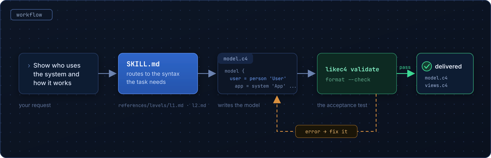

# likec4-skill

An [Agent Skill](https://agentskills.io) that writes [LikeC4](https://likec4.dev) models. Describe a
system, or point it at a repo, and it produces `.c4` files for the C4 levels you asked for. Then it
runs the LikeC4 CLI over them and only hands them back if they pass.

[](https://github.com/nedeadinside/likec4-skill/releases/latest)
[](https://likec4.dev)
[](LICENSE)

<p align="center">
  
</p>

## Install

```bash
npx skills add nedeadinside/likec4-skill
```

That covers Claude Code, Codex, Cursor, OpenCode, Copilot, Gemini CLI and about 45 others. The
[`skills` CLI](https://github.com/vercel-labs/skills) knows where each of them keeps its skills
folder, so you don't have to.

Then ask for something:

> Diagram the architecture of this repo

<details>
<summary>Installing by hand</summary>

The skill is the `likec4-skill/` folder in this repo. Copy it into your agent's skills directory.
The format is identical everywhere, only the path differs.

| CLI         | Global                       | Per-project         |
| ----------- | ---------------------------- | ------------------- |
| Claude Code | `~/.claude/skills/`          | `.claude/skills/`   |
| Codex CLI   | `~/.codex/skills/`           | `.codex/skills/`    |
| OpenCode    | `~/.config/opencode/skills/` | `.opencode/skills/` |

OpenCode reads `~/.claude/skills/` as well, so one Claude Code install covers both.

From the zip, which works anywhere including Windows: download `likec4-skill.zip` from the
[latest release](https://github.com/nedeadinside/likec4-skill/releases/latest) and extract it into
that directory, e.g. `%USERPROFILE%\.claude\skills\`. You want to end up with
`.../skills/likec4-skill/SKILL.md`.

From git, if you'd rather have one copy that updates with `git pull`:

```bash
git clone https://github.com/nedeadinside/likec4-skill
cd likec4-skill
ln -s "$(pwd)/likec4-skill" ~/.claude/skills/likec4-skill
ln -s "$(pwd)/likec4-skill" ~/.codex/skills/likec4-skill
```

</details>

## Why

Ask any agent for a LikeC4 model and you usually get something that reads correctly and doesn't
parse. Invented keywords. Properties in a block that doesn't accept them. Views pointing at
elements nobody declared. You find out when you run the CLI, which is normally long after the
agent has moved on.

Two things fix that, and this skill is both of them.

The grammar sits on disk, split by concern. One file per C4 level, plus deployment, dynamic views
and styling, and `SKILL.md` routes to whichever one the current task needs. The agent reads the
syntax before writing it instead of recalling it.

The CLI is the acceptance test. `likec4 validate` and `likec4 format --check` run against a pinned
version, and nothing gets delivered on a non-zero exit. If there's no CLI available at all, the
skill says so out loud rather than guessing quietly.

That also applies to the skill's own documentation: every LikeC4 snippet in it is compiled by CI
against the pin. A reference file can't drift into syntax the compiler stopped accepting, and the
error messages it quotes are checked to still be errors. Where exit 0 isn't enough — a deployment
view styled with `with { }` validates and renders empty — the reference says so and says what to
check instead.

## What it covers

Six kinds of view. System Context and Container come either from your description or from the
repo's entry points and external calls. Component and Code come from modules and boundaries, and
from classes and functions when that level of detail is worth drawing at all. Deployment covers
environments, nodes and instances. Dynamic views are numbered, step-by-step scenarios.

Styling is in there too: shapes, colours, notation. So are two templates and a procedure for
reading a codebase when nobody wrote the description down in the first place.

## What it produces

Plain `.c4` files. This is the `minimal` template, verbatim, which is also what the skill copies
when you start from nothing:

```likec4
// model.c4
model {
  user = person 'User' 'Describe who uses the system'

  app = system 'My System' 'What it does' {
    ui  = container 'Web UI'   'The frontend'  { technology 'React' }
    api = container 'API'      'The backend'   { technology 'Node.js' }
    db  = database  'Database' 'Primary store' { technology 'PostgreSQL' }

    user -> ui  'uses'         'HTTPS'
    ui   -> api 'calls'        'JSON/HTTPS'
    api  -> db  'reads/writes' 'SQL'
  }

  ext = externalSystem 'Third-party API' 'Payments provider'
  app -> ext 'integrates with' 'REST/HTTPS'
}
```

```likec4
// views.c4
views {
  view index {
    title 'System Context'
    include *
    autoLayout LeftRight
  }

  view containers of app {
    title 'Containers - My System'
    include *
    autoLayout TopBottom
  }
}
```

Rendering and export are LikeC4's job, not this skill's. `npx likec4 start` gives you a local
viewer with drill-down; PNG, Mermaid, D2, PlantUML and draw.io are all
[in the CLI](https://likec4.dev/tooling/cli/).

## What triggers it

The skill fires on its own for requests like:

- "Diagram the architecture of this repo"
- "Draw a C4 container view for our payment system"
- "Document this system as architecture-as-code"
- "Fix or review these `.c4` files"

You can also call it directly: `/likec4-skill` in Claude Code, `$likec4-skill` in Codex.

<details>
<summary>Layout</summary>

```
likec4-skill/                   # the skill itself; repo root holds README and CI
├── SKILL.md                    # entry point: workflow, plus routing to references
├── references/
│   ├── syntax-core.md          # specification / model / views fundamentals
│   ├── predicates.md           # include/exclude, where filters, with overrides
│   ├── levels/                 # one file per level: l1-l4, deployment, flows
│   ├── styling.md
│   ├── project-config.md       # config file, multi-project workspaces, import
│   ├── code-to-diagram.md      # generating C4 from an existing codebase
│   └── setup-and-validation.md
├── templates/
│   ├── minimal/                # smallest valid 3-file project
│   └── full/                   # multi-file: model/, views/, deployment/
└── scripts/
    ├── likec4-version          # the pin, one line — single source of truth
    ├── check.sh                # runs everything below
    ├── check-snippets.sh       # compiles every ```likec4 block in the docs
    ├── snippet-fixtures.md     # the surrounding model those blocks need
    └── bump-pin.sh             # move the pin and re-verify everything
```

References load on demand. `SKILL.md` points at the single file the task needs, so asking for a
container view doesn't drag deployment syntax into the context window.

</details>

<details>
<summary>Development</summary>

`scripts/check.sh` is the whole test suite, and CI runs it on every push:

- both templates `validate` and are already `format --check` clean;
- every ` ```likec4 ` block in `SKILL.md` and `references/` compiles — each one becomes a throwaway
  LikeC4 project and the lot is validated in a single CLI run;
- every block tagged ` ```likec4 invalid ` still **fails** to compile, so the documented error
  messages keep describing the compiler that exists.

Blocks that need surrounding model to compile pull it from `scripts/snippet-fixtures.md`
(` ```likec4 fixture=NAME `), and worked examples that span several files share one project
(` ```likec4 group=NAME `). That keeps the docs made of short fragments while still compiling all
of them.

The pin lives in `scripts/likec4-version`, one line, and nothing else hardcodes it. It's used
unconditionally — a locally installed `likec4` is never substituted, because other versions
disagree quietly (older ones reject dynamic-view flow-control blocks that are correct on the pin).

Upgrading is `scripts/bump-pin.sh [version]`: it moves the pin, rewrites every version mentioned in
the docs, and then runs the full check. It exits 0 only if the skill still holds together on the
new version, so nothing gets bumped into a release that doesn't compile.

A scheduled workflow does that daily against `npm view likec4 version`. Clean bump → pull request.
Something the docs claim stops compiling → issue with the failing output, and the pin stays put,
because that's a documentation fix rather than a version bump.

</details>

## License

Licensed under the [MIT License](LICENSE).